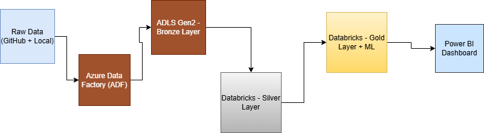

# 🏏 IPL Data Lakehouse Project

A full end-to-end **Data Lakehouse pipeline** for cricket match analytics using:
- **Azure Data Factory** for orchestration
- **Azure Data Lake Gen2** for storage
- **Azure Databricks** for transformation and machine learning
- **Power BI** for dashboard and reporting

This project processes **IPL cricket datasets** from 2008–2020 and follows the **Medallion Architecture**: Bronze, Silver, and Gold layers.

---

## 🧱 Architecture: Medallion Framework

[Raw Data]

(GitHub + Local)
        |
        v
[ADF - Data Ingestion]
        |
        v
[ADLS Gen2 - Bronze Layer]
        |
        v
[Azure Databricks - Silver Layer]
        |
        v
[Azure Databricks - Gold Layer + ML]
        |
        v
[Power BI Dashboard]

